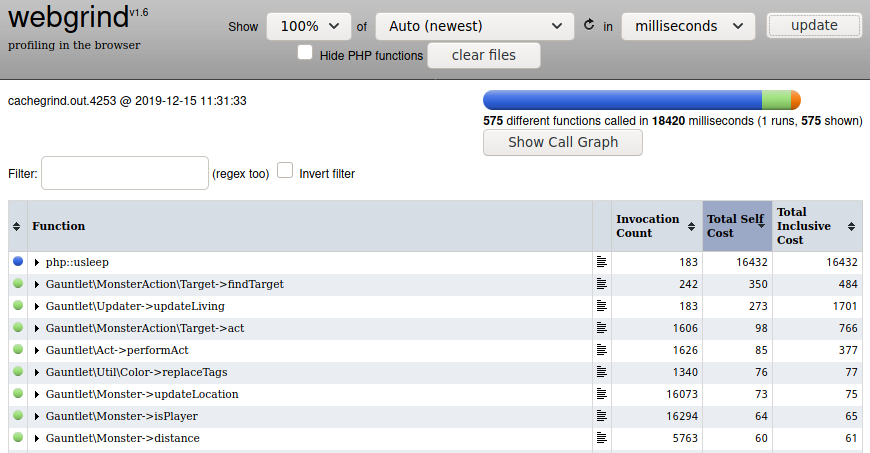

Have you ever encountered a situation where the performance of your PHP script is not great, but you are not sure where the problem is? Then you try to guess and change some part blindly just to see if that would help?

Well, there is a better solution for this, and it is called [Xdebug](https://xdebug.org/). Actually Xdebug is really a collection of tools, but in this case we are interested in the [profiler](https://xdebug.org/docs/profiler).

So, the first step is to install the `xdebug` extension for PHP. Note that I am currently using [Arch linux](https://www.archlinux.org/) so these examples are based on it. Some steps will be different based on your OS.

```
# pacman -S xdebug
```

Next you have to make sure the extension is enabled. I had to edit `/etc/php/conf.d/xdebug.ini` and uncomment this line:

```
;zend_extension=xdebug.so
```

Please note that using this extension (even without the profiler) will likely slow down PHP, so I would recommend enabling it only while you are debugging and turning it off when you are finished.

You can check what extensions are enabled, and what kind of configuration they are using, by using [phpinfo](https://www.php.net/manual/en/function.phpinfo.php). If you are using PHP through a web server, just make a file for example `phpinfo.php` with the following content.

```php
<?php
phpinfo();
```

If you are using PHP from the command line, you can just run `php -i` to get the same output. Of course for convenience we can just get the relevant lines with `php -i | grep xdebug`.

Note that just because the Xdebug extension is enabled, the profiler is not enabled by default. You could enable it globally with setting `xdebug.profiler_enable` in the ini files, but that is not recommended. Running a script through the profiler will make it _much_ slower. It is much better to use the profiler on a case-by-case basis, only for individual requests/scripts that you want to profile.

For the command line PHP, we can enable individual ini settings using the `-d` switch. So running a script through the profiler can be accomplished like this.

```
$ php -d xdebug.profiler_enable=1 script.php
```

For the web, we want to enable the setting `xdebug.profiler_enable_trigger` in php.ini. Then we can _trigger_ the profiler by adding a GET or POST parameter named `XDEBUG_PROFILE`. So for example, assuming you have a local webserver, you could profile a script by pointing your browser to an URL like this.

```
http://localhost/script.php?XDEBUG_PROFILE=1
```

The profiler should output files to your `/tmp` directory by default. They should be files with names like `cachegrind.out.2609` with the last number changing.

If you are not seeing these files in `/tmp`, one likely cause is that you are using _systemd_ and have the `PrivateTmp` setting enabled for your web server or PHP process. Here is an excerpt from their [documentation](https://www.freedesktop.org/software/systemd/man/systemd.exec.html):

> If true, sets up a new file system namespace for the executed processes and mounts private /tmp and /var/tmp directories inside it that is not shared by processes outside of the namespace. This is useful to secure access to temporary files of the process, but makes sharing between processes via /tmp or /var/tmp impossible. If this is enabled, all temporary files created by a service in these directories will be removed after the service is stopped.

I would recommend that you disable the `PrivateTmp` setting in your development environment, as you have hopefully taken other steps to secure your system, such as [binding your web server only to your local IP address](/blog/2020-01-securing-linux-closing-open-ports/).

### Update: Xdebug 3.0

This blog post was originally written for Xdebug 2.x. With the release of 3.0 many setting names have been changed. The changes are documented in the [upgrade guide](https://xdebug.org/docs/upgrade_guide).

To enable the profiler, and to activate it using a trigger, we would put the following in the config file:

```
xdebug.mode=profile
xdebug.start_with_request=trigger
```

To trigger the profiler from the command line, we set the `XDEBUG_TRIGGER` environment variable before running our script:

```
$ export XDEBUG_TRIGGER=1
$ php script.php
```

If this is not working, the likely problem is that environment variables are not being set in [$_ENV](https://www.php.net/manual/en/reserved.variables.environment.php) where Xdebug is looking for them. This can be fixed by adding `E` to your [variables_order](https://www.php.net/manual/en/ini.core.php#ini.variables-order) setting in php.ini:

```
variables_order = "EGPCS"
```

Now you should get cachegrind files in your `/tmp` directory again. You can change the default output directory with the `xdebug.output_dir` setting.

## Webgrind

Now we have generated these nice cachegrind files, but we need some way to view them. They are actually plain-text and not binary, but viewing them in a text editor is not very useful beyond curiosity.

The "standard" go-to tool for this seems to be [KCachegrind](https://kcachegrind.github.io/), but we are going to use a web-based solution called [Webgrind](https://github.com/jokkedk/webgrind). Webgrind is pretty minimalistic, but it contains all the relevant info to find problems and bottlenecks in your code. And you likely have a web server and PHP running already in your system, so you don't have to install an additional app just to view these files.

The UI for Webgrind is pretty self-explanatory. Just select the percentage of functions you want to see, which file to analyze, what unit to show the results in, and click the "update" button. I would recommend seeing 100% of results and using milliseconds as the unit. I prefer to see the actual time something took and using percentage-based results is not so helpful. You can change the default settings in the `config.php` file.

However I did have one problem with Webgrind. I did not get any results when running it and my logs had this error:

> PHP Notice:  Undefined offset: 1 in /srv/http/webgrind/library/Reader.php on line 213

The solution seemed to be just comment the following line in `library/Reader.php`:

```php
$this->headers[$parts[0]] = $parts[1];
```

Perhaps this has been already fixed while you are reading this, but it appears Webgrind has not been updated for a while, so that is why I feel it's relevant here.

Another thing to note is that Webgrind can take a long time to analyze the cachegrind file if it is large. It is not uncommon to get a cachegrind file that is hundreds of megabytes in size. So you might need to increase some resource limits in your php.ini, such as the `max_execution_time` and `memory_limit` settings.

Finally, if all goes well, you should get a table of functions which were called during the execution of the profiled script:



It contains three important columns: **Invocation Count**, **Total Self Cost** and **Total Inclusive Cost**. Invocation count shows how many times that function was called, self cost shows how much time was spent inside the function itself, and inclusive cost shows the total time spent inside the function including any calls it made to other functions.

Additionally, you can click on any function to see a list of outgoing and incoming calls to other functions. There is also a small icon you can click which opens the relevant file and line in a new tab on the browser.

Usually the best place to start is to check if you have functions that have a high "self cost". Generally this means something like nested for-loops or similar heavy processing. After all functions with high "self cost" have been optimized, next part is to look at functions with a high "inclusive cost" and see how that is made up.

The invocation counts are also extremely useful because usually it is easy to see if something is being called more times than expected. You can also find bugs this way, not just performance issues. For example, suppose you have an array with 1000 items, and you want to call some function on each item once, but your invocation count shows 2000, you immediately know it was called twice.

Finally, I would like to remind that do not leave Webgrind exposed on a publicly accessible web server, as this obviously has some security implications.

Hopefully I will be able to write more blog posts in the future about how to write good PHP code and avoid common performance issues. In the meantime, happy optimizing!
