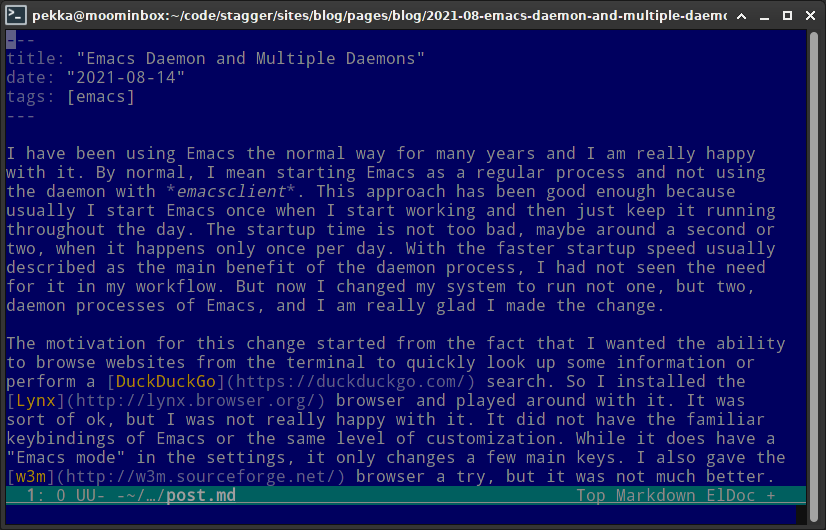
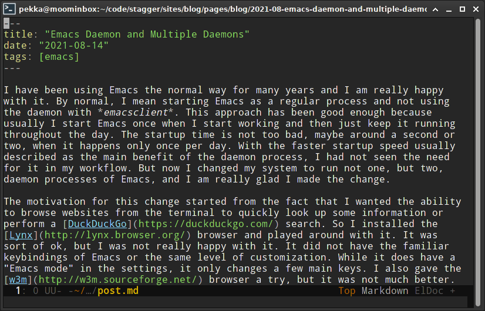
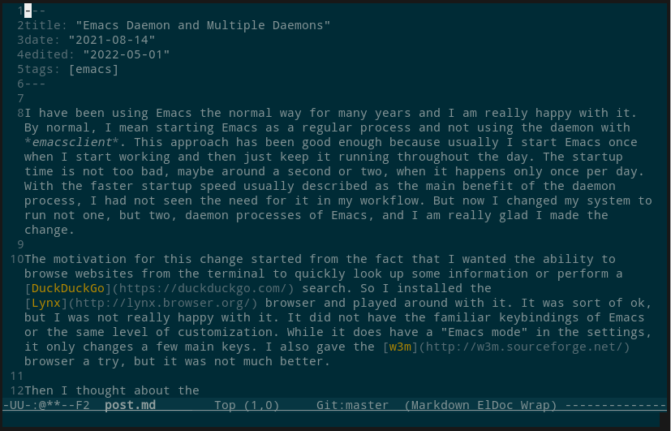

I have been using Emacs the normal way for many years and I am really happy with it. By normal, I mean starting Emacs as a regular process and not using the daemon with *emacsclient*. This approach has been good enough because usually I start Emacs once when I start working and then just keep it running throughout the day. The startup time is not too bad, maybe around a second or two, when it happens only once per day. With the faster startup speed usually described as the main benefit of the daemon process, I had not seen the need for it in my workflow. But now I changed my system to run not one, but two, daemon processes of Emacs, and I am really glad I made the change.

The motivation for this change started from the fact that I wanted the ability to browse websites from the terminal to quickly look up some information or perform a [DuckDuckGo](https://duckduckgo.com/) search. So I installed the [Lynx](http://lynx.browser.org/) browser and played around with it. It was sort of ok, but I was not really happy with it. It did not have the familiar keybindings of Emacs or the same level of customization. While it does have a "Emacs mode" in the settings, it only changes a few main keys. I also gave the [w3m](http://w3m.sourceforge.net/) browser a try, but it was not much better.

Then I thought about the [eww](https://www.gnu.org/software/emacs/manual/html_node/eww/) browser that comes with Emacs. It was the perfect solution for this situation because it also runs on the terminal and fully integrates into the Emacs ecosystem, so I have not just the default Emacs keybindings, but my own customized keybindings and functions, by default. However, this is where the startup speed becomes a significant factor. Because now I am not just opening Emacs once per day, but many times whenever I want to quickly do something from the terminal, whether that is to edit a file or to perform a web search. So at this point it became clear that I need to set up the daemon.

The daemon is simply a background process that runs like a server. Then when you open a new Emacs window (or *frame* in Emacs terminology), it will just connect to the server process as a client. When you close the window, for example with <kbd>C-x C-c</kbd>, the daemon will keep running. The daemon is started by running `emacs --daemon`. If you need to run multiple daemons, you need to give each one a unique name by starting them with `emacs --daemon=name` where `name` is something you choose.

Once the daemon is running, you create new graphical Emacs window with the command `emacsclient -c` and a new terminal window with `emacsclient -t`. If you use a named daemon, you need to give the name using the `-s` argument. For example if you have names **gui** and **term**, you would use them with `emacsclient -s gui -c` and `emacsclient -s term -t` respectively.

So why did I need two daemons? Well, it turns out that it is quite difficult to find a color theme that looks good on both graphical and terminal version of Emacs. I use the [solarized](https://ethanschoonover.com/solarized/) theme on my graphical UI but that theme looks really **blue** on the terminal:



While it does have a sort of nice retro feel, I wasn't completely happy with it. Additionally, there were a few other settings that I wanted to change for terminal use. So it became clear the solution was to run two daemons, one for graphical use and one for terminal use.

The best way to run daemon processes is to configure them in your process manager. That way they are started automatically when you log in. My distro uses *systemd* for process management so that was the way to go. I created two unit files for *systemd* with the following names and contents.

*~/.config/systemd/user/emacs-gui.service*:

```
[Unit]
Description=Emacs text editor (GUI)
Documentation=info:emacs man:emacs(1) https://gnu.org/software/emacs/

[Service]
Type=forking
ExecStart=/usr/bin/emacs --daemon=gui
ExecStop=/usr/bin/emacsclient -s gui --eval "(kill-emacs)"
Environment=SSH_AUTH_SOCK=%t/keyring/ssh ESRVNAME=gui
Restart=no

[Install]
WantedBy=default.target
```

*~/.config/systemd/user/emacs-term.service*:

```
[Unit]
Description=Emacs text editor (terminal)
Documentation=info:emacs man:emacs(1) https://gnu.org/software/emacs/

[Service]
Type=forking
ExecStart=/usr/bin/emacs --daemon=term
ExecStop=/usr/bin/emacsclient -s term --eval "(kill-emacs)"
Environment=SSH_AUTH_SOCK=%t/keyring/ssh ESRVNAME=term
Restart=no

[Install]
WantedBy=default.target
```

The important thing to note is the environment variable `ESRVNAME` which can be read from inside Emacs. This allows conditional initialization based on whether it is running the graphical or the terminal version.

It does not make sense to run these as system-wide services so they are defined as user-level services. They can be managed using *systemctl* with the `--user` option and sudo privileges are not required:

```
$ systemctl start --user emacs-gui.service
$ systemctl start --user emacs-term.service
$ systemctl enable --user emacs-gui.service
$ systemctl enable --user emacs-term.service
```

Now it is easy to perform conditional logic during the initialization and choose different theme and settings for graphical and terminal versions:

```lisp
;; Settings for GUI only
(when (string-equal (getenv "ESRVNAME") "gui")
  ;; Highlight matching parens
  (show-paren-mode t)

  ;; Highlight current line
  (global-hl-line-mode t)

  ;; Show line numbers
  (global-linum-mode t)

  ;; Theme for GUI
  (load-theme 'solarized-dark t))

;; Settings for terminal
(when (string-equal (getenv "ESRVNAME") "term")
  ;; Theme for terminal
  (load-theme 'wombat t))
```

I chose the **wombat** theme for the terminal for now which looks quite nice:



Thanks to lightning-fast startup time, it is finally pleasant to use Emacs for quickly editing some config files in the terminal. Before I used [nano](https://www.nano-editor.org/) for most of that. I set some environment variables in Bash to use Emacs as the default editor and also created a shortcut `ed` to quickly edit a file:

```
# Default programs
export EDITOR="emacsclient -s term -t"
export VISUAL="emacsclient -s gui -c"

# editor
function ed() {
    $EDITOR "$@"
}
```

I am really happy with the result. If you are using Emacs and also working in the terminal, I really encourage you to use the daemon if you are not already. It's definitely worth it, and will make the Emacs experience more enjoyable. Finally, I should credit the excellent [Emacs Wiki](https://www.emacswiki.org/emacs/MultiEmacsServer) for the source of much of this information.

## Update: System Freeze on Shutdown

This setup of running two daemons caused an unexpected problem. My system would hang whenever I attempted to reboot or shutdown it. The problem is caused by Emacs trying to write some files before the process exits. When systemd shuts down the daemons, they attempt to write to the same files at the same time. Apparently this creates some race condition with the file locks causing the writes to never return.

The problematic files in my case were `ac-comphist.dat`, `ido.last` and `recentf` located in the `~/.emacs.d` directory. I solved the problem by using separate files for each daemon by adding the `ESRVNAME` variable to the file names:

```lisp
(setq ac-comphist-file
      (concat "~/.emacs.d/ac-comphist-" (getenv "ESRVNAME") ".dat"))
(setq ido-save-directory-list-file
      (concat "~/.emacs.d/ido-" (getenv "ESRVNAME") ".last"))
(setq recentf-save-file
      (concat "~/.emacs.d/recentf-" (getenv "ESRVNAME")))
```

This is a bit ugly solution, but it works. Obviously it would be preferable to not keep separate version of these files, but I will attempt to proceed with this for now.

## Update 2: Single Daemon

After running two daemons for a while, I decided to look at the issue again with the hope of using only a single emacs daemon. After some research, it turns out that *solarized-dark* is not displayed with correct colors in terminal because emacs does not recognize the capabilities (color support) of the terminal. This problem is actually addressed directly in the [Emacs FAQ](https://www.gnu.org/software/emacs/manual/html_mono/efaq.html#Colors-on-a-TTY). This can be fixed by setting the environment variable `COLORTERM` to `truecolor` for 24-bit color support. Of course you need to make sure your terminal actually supports 24-bit colors for this to work!

Now I am running a single emacs daemon with the systemd unit file shown below.

*~/.config/systemd/user/emacs.service*:

```
[Unit]
Description=Emacs text editor
Documentation=info:emacs man:emacs(1) https://gnu.org/software/emacs/

[Service]
Type=forking
ExecStart=/usr/bin/emacs --daemon
ExecStop=/usr/bin/emacsclient --eval "(kill-emacs)"
Environment=SSH_AUTH_SOCK=%t/keyring/ssh COLORTERM=truecolor
Restart=no

[Install]
WantedBy=default.target
```

And now the *solarized-dark* theme shows correctly in terminal:


