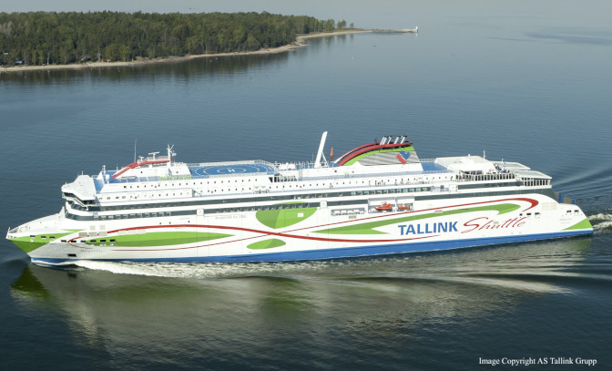
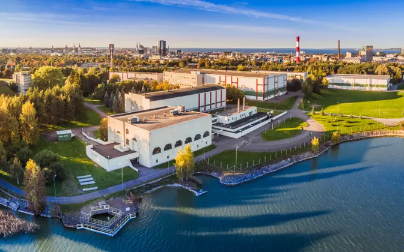

Shopping is fun in general but shopping for shares of quality companies is *really fun*. The dividend payments that they provide are a good source of funds for other types of shopping such as clothes or luxury items. So far my investing efforts have been mainly focused on Finland and US based companies. I have previously written about [stocks in Helsinki](/blog/2017-12-finding-quality-stocks-in-helsinki/) to provide some ideas for investments. While I want to keep those countries as the biggest weights in my portfolio, I am also exploring other markets for smaller additional positions. In this post I will take a look at Estonia.

The reason why I am interested in Estonia is that my personal company is located there and I am also considering living there in the future. I believe that if I regularly use the products or services of a company, I should be a shareholder as well, as I [wrote before](/blog/2020-03-own-the-companies-you-use/). Thus for me, living in Estonia would also mean being an investor in some of their key companies that I use frequently. Additionally, Estonia appears to be very business- and investment-friendly as far as their politics go which is a big factor for me. Also it is located near Finland so visiting family would be very convenient.

The equity market of Estonia is very small and illiquid which is definitely a negative factor. The lack of liquidity means that not many shares are traded daily but it is not very important from the perspective of a long-term buy-and-hold investor. While Estonia has produced many technology companies with much success, such as Skype and [Wise](https://wise.com/) for example, they have not been listed on their domestic exchange. I hope this trend will change in the future.

## LHV Group

[LHV Group](https://investor.lhv.ee/en/) is currently the most valuable listed company in Estonia. They are focused on banking and financial services. Their share price has had amazing performance this year, tripling from about 15 € to about 45 € as I write this. They also have a presence in the UK. I use LHV for the banking needs of my personal company as well. They offer commission-free trading of Baltic equities but their trading fees for other markets are very high.

> LHV Group is the largest domestic financial group and capital provider in Estonia. LHV Group’s key subsidiaries are LHV Pank, LHV Varahaldus, and LHV Kindlustus. LHV employs over 620 people. LHV’s banking services are used by 290,000 clients, the pension funds managed by LHV have 174,000 active clients, and LHV Kindlustus protects a total of 132,000 clients. LHV's UK branch offers banking infrastructure to 160 international financial services companies, via which LHV's payment services reach clients around the world.

The market capitalization of LHV is around 1.36 B€ at this time and they paid a dividend of 0.29 € per share in 2021.

## Tallinna Sadam

[Tallinna Sadam](https://www.ts.ee/en/) (Port of Tallinn) is the company that manages Tallinn Port that allows operations for cruiselines and cargo vessels. The Estonian government owns 67% of the entity while 33% is owned by funds and private investors. They also operate some ice breakers and provide supporting activities for shipping. The Covid pandemic has had a big negative impact on their operations because passenger traffic between Estonia and Finland, for example, has been largely suspended.

> Tallinna Sadam is one of the largest cargo- and passenger port complexes in the Baltic Sea region, which serves annually 10 million passengers and 20 million tons of cargo in average. In addition to passenger and freight services, Tallinna Sadam group also operates in shipping business via its subsidiaries – OÜ TS Laevad provides ferry services between the Estonian mainland and the largest islands, and OÜ TS Shipping charters its multifunctional vessel Botnica for icebreaking and construction services in Estonia and offshore projects abroad. Tallinna Sadam group is also a shareholder of an associate AS Green Marine, which provides waste management services. The group's sales in 2020 totalled EUR 107.4 million, adjusted EBITDA EUR 58.4 million and profit EUR 28.5 million.

The market capitalization of Tallinna Sadam is around 490 M€ at this time and they paid a dividend of 0.08 € per share in 2021.

## Tallinna Kaubamaja Grupp

[Tallinna Kaubamaja Grupp](https://www.tkmgroup.ee/en) operates retail stores and shopping malls in Estonia under the [Kaubamaja](https://www.kaubamaja.ee/) and [Selver](https://www.selver.ee/) brands. They also sell automobiles specializing in [KIA](https://www.kia.ee/), footwear under the [ABC King](https://www.abcking.ee/) brand, and operate beauty products stores under the [I.L.U.](https://www.ilu.ee/) brand. The largest shareholder of the group is [NG Investeeringud](https://www.nginvest.ee/defaulten) which owns 67% of the company.

> Operators that form Tallinna Kaubamaja Group mostly pursue their business in the sphere of retail and wholesale trade. The Group companies contribute more than one tenth of retail trade in Estonia in general and employ more than 3,500 people. The Group owns well-known brands like Kaubamaja, Selver, Selveri Köök, Tartu Kaubamaja Centre, Viking Motors, KIA, ABC King, SHU, I.L.U., Viking Security. The loyalty programme of the Group, Partner Card, extends to 585,000 loyal customers and is the largest in Estonia.

The market capitalization of Tallinna Kaubamaja Grupp is around 450 M€ at this time and they paid a dividend of 0.60 € per share in 2021.

## Tallink Grupp

[Tallink Grupp](https://www.tallink.com/investors) operates cruise ships under the Tallink and Silja Line brands. They have a fleet of 15 vessels and also operate 4 hotels. Their most important routes are Finland-Sweden and Finland-Estonia which generated 79% of their revenue in 2020. Their operations have been severely impacted by the Covid pandemic. They issued more common stock in a public offering in 2021 which diluted existing shareholders but was necessary to stay afloat. Their largest shareholder is [Infortar](https://www.infortar.ee/en/), an Estonian private investment company, which holds 39%.

> AS Tallink Grupp is one of the leading providers of passenger and cargo transport services in the northern Baltic Sea region. The company's fleet consists of 15 vessels and the company operates various routes under the brands of Tallink and Silja Line.

The market capitalization of Tallink Grupp is around 430 M€ at this time and they paid no dividend in 2021.

## Tallinna Vesi

[Tallinna Vesi](https://tallinnavesi.ee/en/) is a water utility that provides drinking water for Tallinn residents. The City of Tallinn owns 55% of the shares and [Utilitas](https://www.utilitas.ee/en/), Estonian energy company, owns 20%.

The market capitalization of Tallinna Vesi is around 300 M€ at this time and they paid a dividend of 0.65 € per share in 2021.

## Merko Ehitus

[Merko Ehitus](https://merko.ee/en/) is a construction company. They construct residential and commercial buildings mainly in Tallinn and Tartu.

> AS Merko Ehitus group consists of AS Merko Ehitus Eesti in Estonia, SIA Merks in Latvia, UAB Merko Statyba in Lithuania and Peritus Entreprenør AS in Norway. Besides providing construction service as a general contractor, the group's other major area of activity is apartment development. As at the end of 2020, the group employed 666 people, and the group's revenue for 2020 was EUR 316 million.

The market capitalization of Merko Ehitus is around 270 M€ at this time and they paid a dividend of 1 € per share in 2021.

## Harju Elekter

[Harju Elekter](https://harjuelekter.com/home/) manufactures electrical systems and equipment for industrial uses.

> Harju Elekter is an international industrial group with more than 50 years of experience, with its main activity being the development and production of electrical and automation solutions. An increasingly significant portion of Harju Elekter's technical solutions are aimed at the renewable energy sector, thus offering complete plans for solar power plants, electric vehicle charging stations and other related solutions. Its factories in Estonia, Finland, Sweden, and Lithuania employ approximately 800 specialists, and the Group's sales revenues for the first six months 2021 were 67,0 million euros.

The market capitalization of Harju Elekter is around 140 M€ at this time and they paid a dividend of 0.16 € per share in 2021.

Hopefully this post gives a good overview of the largest publicly traded Estonian companies. As we can see, there are not many choices and the size of the companies drops below 100 M€ in market capitalization after the listed names. However there are still some interesting possibilities among them. I particularly like Kaubamaja Grupp because retail sales tends to be very stable business that is not too affected by economic cycles. After all, we need to eat every day.
