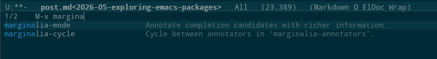
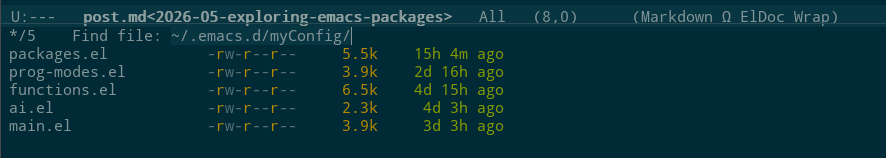

After keeping my Emacs configuration somewhat static for a few years, I have made some bigger changes recently. I changed which packages I am using for core functionality such as completions and search. This post highlights some of them and the reasons behind choosing them. I should note that I have only used some of them for a week, so I am still at the very beginning of my learning journey. I guess learning Emacs is a never-ending rabbit hole!

## Omega Keys

I have to start any discussion about Emacs packages with [Omega Keys](https://github.com/peklaiho/omega-keys), my own package for custom key mappings. This is not new as I have used it for a couple of years already, but I have not properly introduced it in my blog. Omega Keys provides modal editing similar to Vim, with a separate "command mode" and "edit mode". The key difference from Vim is the main keybindings for moving around. Vim uses <kbd>h</kbd>, <kbd>j</kbd>, <kbd>k</kbd>, <kbd>l</kbd> which have never felt natural to me. Omega Keys also uses <kbd>j</kbd>, <kbd>k</kbd>, <kbd>l</kbd> but then <kbd>i</kbd> to move up. This mimics the layout of normal arrow keys and feels much more natural to me. It is also a delightful demonstration of how easy it is to add functionality to Emacs: excluding the keybindings themselves, Omega Keys is only about 40 lines of code!

## Projects

Not an external package, but I have recently discovered the built-in [Projects](https://www.gnu.org/software/emacs/manual/html_node/emacs/Projects.html) functionality of Emacs. The concept is very simple but useful: when Emacs finds a `.git` directory, it treats all files under that directory as belonging to the same project. Then you can perform commands that use the project as their scope. For example, use `project-find-file` instead of regular `find-file` to filter the candidates only to files within the project. Similarly, use `project-switch-to-buffer` when you want to switch to another buffer within the same project, so you get an already-narrowed list of candidate buffers to choose from. Opening another file from the same project I am currently working on is about the most common thing I do in Emacs, so any help with that feels like a big deal!

## Vertico

I am now using [Vertico](https://github.com/minad/vertico) for completions. It displays completion candidates in a vertical list at the bottom of the screen. The nice thing about Vertico is that it is very lightweight, and largely hooks into Emacs default functionality, specifically the `completing-read` function. This means that not only it takes over all default Emacs completions, but that you can perform any custom completions using `completing-read` as well, and they pop up in Vertico.

Vertico is highly customizable. For example the completion candidates can be displayed in a full-sized regular buffer with `vertico-buffer-mode` or in a grid with `vertico-grid-mode`. The sorting of candidates can be customized by setting the `vertico-sort-function`. But sometimes you want different completion settings based on the situation rather than global settings. Vertico supports this using the `vertico-multiform-mode` which allows you to define completion settings based on type of completion candidates or even based on the command which initiated the completion. Of course all keybindings of Vertico can be customized by editing the `vertico-map` keymap as well.

After Vertico is enabled, you can just use the standard Emacs functions, for example `switch-to-buffer` to switch buffers, `find-file` to open a file, and `dired` to open a directory. They all pop up completions using Vertico now.

Before I used the built-in [ido-mode](https://www.gnu.org/software/emacs/manual/html_mono/ido.html) (interactive do) for changing buffers and opening files. I have to say that I absolutely love it. I could always find what I wanted with just a few keystrokes. I also used [Ivy](https://github.com/abo-abo/swiper) for some custom completions. I would summarize that Ivy and Vertico are very similar, but Vertico is simpler and uses more built-in Emacs functions.

There are a few things I am still missing from my previous setup such as ignoring unwanted buffers with `ido-ignore-buffers`. But the beauty of Emacs is that I can always customize it and build what I want! For now I am pretty happy with Vertico and the default settings with slight customizations.

## Marginalia

It seems that every post that recommends Vertico also recommends pairing it with [Marginalia](https://github.com/minad/marginalia). That is with good reason because they go well together. Marginalia adds metadata for completion candidates. I find this especially useful when completing functions (think of <kbd>M-x</kbd> or <kbd>C-h f</kbd> for example). Marginalia shows the docstring of each function in completions:

When completing files, Marginalia defaults to showing permissions, attributes and time of last modification:

I feel that file permissions for example might not be that useful to see by default. But I am keeping the defaults for now and possibly customizing more later. Buffer completions are quite nice though, because they show the active major mode!

## Orderless

I consider [Orderless](https://github.com/oantolin/orderless) a practically necessary addition to Vertico for fast lookup of completion candidates. Orderless changes the search for completion candidates so that search terms can be entered in any order. For example, you can type `buf swi to` to find the `switch-to-buffer` function. Obviously the same goes for file and buffer completions. This is very useful because you do not need to remember the correct order of words in a name. The flipside is that you will get a few more wrong candidates also, but it generally works out when you continue narrowing the results by typing a few more characters.

## Consult

[Consult](https://github.com/minad/consult) is another package that is often recommended together with Vertico and others listed here. It adds enhanced versions of many standard Emacs commands that are related to search and navigation, such as opening a file or switching to a buffer. The part that I found a little confusing was that if you run `consult-buffer` for example as a replacement for `switch-to-buffer`, the list of completions will include files as well as buffers. Maybe useful when you just want to open something, regardless of whether it is open already. But I generally choose the type of what I am looking for first (file, buffer, etc.) and only then start looking for a specific entry.

The main feature from Consult that I use is `consult-line` which, when combined with Orderless, is very close to [Swiper](https://github.com/abo-abo/swiper). I have been using Swiper forever as my default way to search a buffer and I really love it. So I am very happy that I found a replacement which works well enough that I can happily retire Swiper for now. I also like `consult-outline` as a quick way to jump to a headline or a function definition. Finally, I found `consult-yank-from-kill-ring` interesting as a way to preview the kill ring contents before selecting which entry to yank.

Consult contains lots of features and I have barely scratched the surface yet. But it's better to become familiar with a small surface area first, rather than trying to take in all the bells and whistles at once!

I must admit that I have been so happy with Swiper that I never really learned to use the standard Emacs search functionality such as [incremental search](https://www.gnu.org/software/emacs/manual/html_node/emacs/Incremental-Search.html) and [occur](https://www.gnu.org/software/emacs/manual/html_node/emacs/Other-Repeating-Search.html). Am I missing out on something important by not learning those? Perhaps the standard search functions are another adventure I should embark on later!

## Embark

[Embark](https://github.com/oantolin/embark) is yet another package that integrates well with Vertico and Consult. Embark provides a context menu for completion candidates. For example, if you are completing a list of buffers, and you spot a buffer you want to kill, you can just do that right there and then, without first exiting Vertico and then proceeding to kill the buffer. Of course Embark provides context-aware actions for buffers as well, so you can execute actions on active region, URLs, functions, S-expressions and so forth.

The most interesting feature of Embark seems to be the ability to grab a list of completions and then create a new buffer out of them that is also context-aware. Consider for example that you are searching files with `grep` and the results are displayed in Vertico. With Embark you can grab that list of search results into a new buffer, and do so in a way that the new buffer retains the functionality of a "grep results buffer", so you can hit Enter on any line to jump to the corresponding location in code.

As I am writing this, I did not install Embark yet, but will probably try it soon. I figured it is better to learn Vertico and Consult first!

## Conclusion

Changing the core workflows (such as completions and search) of your editor is a big deal. Change can be difficult after years of doing things in a particular way and developing a muscle-memory. But I feel like I managed to transition really well and now I feel slightly more productive with Emacs than before. The packages listed here seem to be widely recommended within the Emacs community. They are also actively maintained, highly customizable, and integrate well within standard Emacs functionality.
